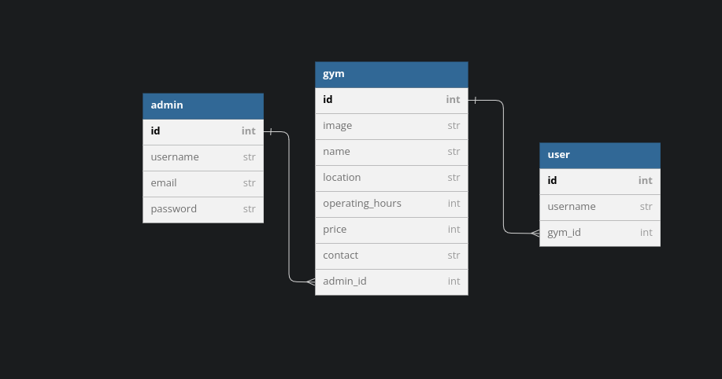

# GYMFINDER PROJECT

## 30-03-2023

## Author information

    The following projects are created by:
    - Paul  Ngugi
    - Jennifer Sammy
    - Enock Yegon
    - Antony Ehaji

#### setup/installation requirements

    - download a zip file under code tab.
    - extract the downloaded zip folder
    - open the folder with VS code
    - Run this command on the terminal to run server:
    console $ rails server
    - Use Postman to view the data through routes in BDD

## ERD

## BDD

As a user should;

    - User can view and get contacts of the owner if the gym.

As an admin one should:

    - Sign up to the app
    - Login to his account
    - View all gyms available
    - Create a gym when only he/she is logged in
    - Update a gym when only he/she is logged in
    - Delete a gym when only he/she is logged in
    - See a single gym when only he/she is logged in
    - Log out of his account

## Bugs

    The application works perfectly well, no bugs.

## Technologies

    The following projects used the technologies
    :
    - RUBY
    - RAILS
    - Active Record

## Support and Contact information

## License and Copyright Information

Copyright 2023 Paul Licensed under [MT License](https://github.com/Paul-ike/gymfinder/blob/master/LICENSE)

## Video Link

